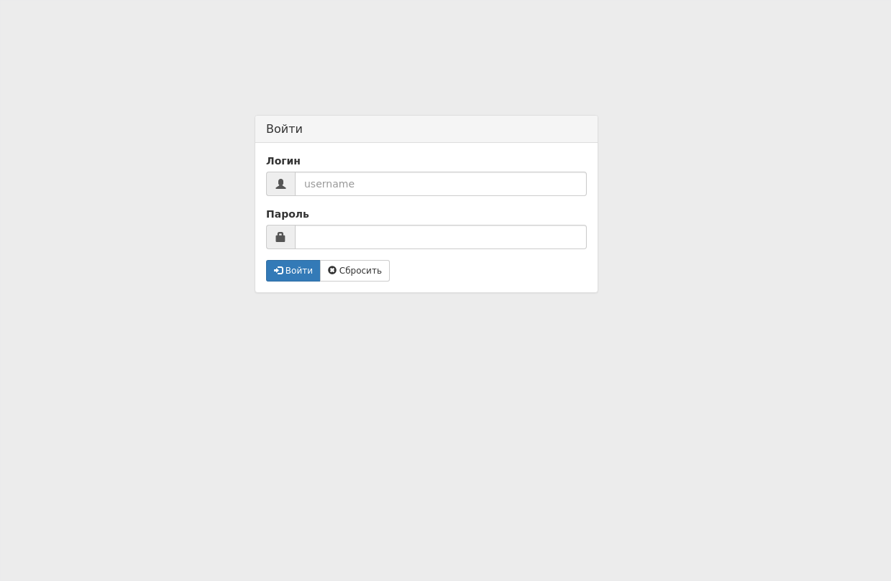

## Установка:
Работа предполагается на python3.
Я предпочитаю запускать wsgi сервер на связке uWSGI + Nginx, так что ставить будем соответствующие пакеты.

##### На Fedora25 нужные пакеты можно установить так:

Для начала подготовим систему, очистим и обновим пакеты. Процесс обновления долгий, так что можно пойти заварить себе чай :)
```
# dnf clean all
# dnf -y update
```

Затем установим зависимости
```
# dnf -y install python3 python3-devel python3-pip python3-pillow mariadb mariadb-devel uwsgi nginx uwsgi-plugin-python3 net-snmp net-snmp-libs net-snmp-utils net-snmp-devel net-snmp-python git redhat-rpm-config
```

Лучше чтоб версия python по умолчанию была третья:
```
# ln -sf python3 /usr/bin/python
```

Условимся что путь к папке с проектом находится по адресу: */var/www/djing*.
Дальше создадим каталок для web, затем обновляем pip и ставим проект через pip:
```
# mkdir /var/www
# cd /var/www
# pip3 install --upgrade pip
# git clone https://github.com/nerosketch/djing.git
# pip3 install -r djing/requirements.txt
```

Скопируем конфиги из примеров в реальные:
```
$ cd /var/www/djing
# cp djing/settings_example.py djing/settings.py
# cp agent/settings.py.example agent/settings.py
```

Затем отредактируйте конфиги для своих нужд.

Для удобства я создаю пользователя и группу http:http, и всё что связано с web-сервером запускаю от имени http.
```
# groupadd -r http
# useradd -l -M -r -d /dev/null -g http -s /sbin/nologin http
# chown -R http:http /var/www
# chown -R http:http /etc/nginx
# chown -R http:http /etc/uwsgi.*
# chown -R http:http /run/uwsgi/
```

### Настройка WEB Сервера
Конфиг Nginx на моём рабочем сервере выглядит так:
```nginx
user http;
worker_processes auto;
pid /run/nginx.pid;

events {
    worker_connections 1024;
}

http {
    sendfile            on;
    tcp_nopush          on;
    tcp_nodelay         on;
    keepalive_timeout   65;
    types_hash_max_size 2048;

    include             /etc/nginx/mime.types;
    default_type        application/octet-stream;

    upstream djing { server unix:///run/uwsgi/djing.sock; }

    server {
        listen 80;
        server_name  <ваш-домен>.com;
        root         /var/www/djing;
        charset      utf-8;

        # укажите где лежит ваш раздел с медиа для сайта
        location /media  {
            alias /var/www/djing/media;
        }

        # местоположение статики           
        location /static {
            alias /var/www/djing/static;
        }

        # тут надо указать путь куда у вас установился Django + путь к статике админки
        # путь к Django тут: /usr/lib/python3.5/site-packages/django
        # путь к статике соответственно: contrib/admin/static/admin
        location /static/admin {
            alias /usr/lib/python3.5/site-packages/django/contrib/admin/static/admin;
        }

        # на корневом url / реагируем с помощью сокета проекта
        # у нас он называется "djing": upstream djing { server ...
        location / {
            uwsgi_pass djing;
            include uwsgi_params;
        }
    }
}
```

Это минимальный конфиг Nginx для работы. Проверте файл /run/uwsgi/djing.sock на доступность пользователю http для чтения.

Далее настраиваем uWSGI. Мой конфиг для uWSGI в режиме emperor:
> /etc/uwsgi.ini
```ini
[uwsgi]
uid = http
gid = http
pidfile = /run/uwsgi/uwsgi.pid
emperor = /etc/uwsgi.d
stats = /run/uwsgi/stats.sock
chmod-socket = 660
emperor-tyrant = true
cap = setgid,setuid
```

Зададим конфиг для *uwsgi vassal*:
> /etc/uwsgi.d/djing.ini
```ini
[uwsgi]
chdir=/var/www/djing/
module=djing.wsgi
master=True
processes=8
;socket=/run/uwsgi/djing.sock
http-socket=:8000
chmod-socket=664
pidfile=/run/uwsgi/django-master.pid
vacuum=True
plugin=python3
```

Примените к созданному файлу пользователя http:
> \# chown http:http /etc/uwsgi.d/djing.ini

Перед пробой запуска отключим все ограничения фаервола:
> \# systemctl stop firewalld

Или даже отключить, если вы отложите настройку *firewalld* на потом:
> \# systemctl disable firewalld

Перед тем как попробовать запустить тестовый сервер скомпилируйте переводы:
> \$ ./manage.py compilemessages -l ru

Попробуем запустить *uwsgi* и djing без Nginx:
> \# uwsgi --gid http --uid http /etc/uwsgi.d/djing.ini

пробуем зайти в биллинг с браузера на <адрес сервера>:8000. Вам должен показаться диалог входа в систему:


Для того чтоб uwsgi применял к своим файлам пользователя http, надо подредактировать системный юнит uwsgi, у меня он имеет такой путь:
> /usr/lib/systemd/system/uwsgi.service

В нём надо чтоб chown менял пользователя на http, а не на uwsgi:
> ExecStartPre=/bin/chown -r http:http /run/uwsgi

Теперь, если всё прошло успешно, поменяйте в конфиге */etc/uwsgi.d/djing.ini* сокет с http на unix socket:
Раскомментируйте это:
> socket=/run/uwsgi/djing.sock

И закомментируйте эту строку:
> http-socket=:8000

Строка *http-socket=:8000* была для теста, чтоб посмотреть работает-ли uwsgi сам по себе.

Теперь можно попробовать запустить *nginx* и *uwsgi*. Ставим в **djing/settings.py** опцию **DEBUG = False**, и пробуем запустить нужные юниты:

> \# systemctl start uwsgi\
> \# systemctl start nginx

По умолчанию на fedora включено SELinux и вы не сможете зайти на сайт пока не настроите его. Для того, чтоб проверить всё
ли правильно мы настроили, отключите *SELinux* коммандой **setenforce 0* и попробуйте зайти. После успешного запуска вы
можете снова включить опцию и настроить её.


### Настраиваем биллинг
Все настройки биллинга находятся в файле *djing/settings.py*. Большинство опций вы можете найти в документации
[Django settings](https://docs.djangoproject.com/en/1.9/ref/settings).
Те опции, которые были добавлены мной в рамках проекта *djing*, описаны ниже в этом разделе документации по установке.

#### djing/settings.py
**USE_TZ** &mdash; Это опция *Django*, но если вы не работаете в разных часовых диапазонах то я не рекомендую включать
эту опцию чтоб небыло путаницы со временем. Это связано с тем что я ещё не тестировал поведение работы со временем при
включённой опции *USE_TZ*.

**ALLOWED_HOSTS** &mdash; Тоже опция *Django*, но важная для безопасности, укажите в списке возможные имена вашего сервера.
Подробнее в документации [Django settings](https://docs.djangoproject.com/en/1.9/ref/settings/#allowed-hosts).

**DEFAULT_PICTURE** &mdash; Это путь к изображению по умолчанию, оно используется когда нужное изображение не найдено.

**PAGINATION_ITEMS_PER_PAGE** &mdash; Количество выводимых элементов списка на странце с таблицей. Например, если поставить 30,
то на странице абонентов на одной странице будет выведено 30 строк абонентов.

**PAY_SERV_ID** &mdash; Эта опция, так же как и **PAY_SECRET** опции для платёжной системы *AllTime24*, если вы используете любую
другую платёжную систему то можете удалить эти опции.

**DIALING_MEDIA** &mdash; Путь, где биллинг сможет найти файлы записей asterisk чтоб вывести статистику звонков.
Подробнее читайте в описании работы с [АТС](./ats.ms).

**DEFAULT_SNMP_PASSWORD** &mdash; Пароль snmp по умолчанию для устройств, чтоб при создании устройства он был заполнен в нужном поле.
Если нет такого пароля то оставьте пустым или None.

**TELEPHONE_REGEXP** &mdash; Регулярное выражение для валидации номера телефона.

**ASTERISK_MANAGER_AUTH** &mdash; Данные для управления АТС [Asterisk](https://www.asterisk.org/), пример заполнения есть в *djing/settings_example.py*.


#### Создание БД
Подразумевается что сервер баз данных у вас уже есть, или вы его можете установить сами.
В конфиге настроить БД можно по инструкции [Django databases](https://docs.djangoproject.com/en/1.9/ref/settings/#databases).

Убедитесть что вы в папке с проектом, комманда **pwd** должна выдать */var/www/djing*.
Чтоб создать бд, как описано в документации [Django admin \& migrate](https://docs.djangoproject.com/en/1.9/ref/django-admin/#migrate),
нужно запустить **./manage.py migrate** чтоб создать структуру БД. Вывод будет примерно таким:
```
$ ./manage.py migrate
Operations to perform:
  Apply all migrations: mapapp, contenttypes, dialing_app, msg_app, taskapp, photo_app, accounts_app, devapp, statistics, tariff_app, admin, sessions, chatbot, auth, abonapp
Running migrations:
  Rendering model states... DONE
  Applying mapapp.0001_initial... OK
  Applying devapp.0001_initial... OK
  Applying devapp.0002_auto_20160909_1018... OK
  Applying devapp.0003_device_map_dot... OK
  Applying photo_app.0001_initial... OK
  Applying contenttypes.0001_initial... OK
...
  Applying taskapp.0012_auto_20170407_0124... OK
  Applying taskapp.0013_auto_20170413_1944... OK
  Applying taskapp.0014_auto_20170416_1029... OK
  Applying taskapp.0015_auto_20170816_1109... OK
```

После этого вам стоит создать супер пользователя чтоб зайти в систему.
```
$ ./manage.py createsuperuser
```
В интерактивном режиме ответьте на вопросы.
```
$ ./manage.py createsuperuser
Username: username
Telephone: +12223334455
Password: 
Password (again): 
Superuser created successfully.
```
Обратите внимание на то что номер телефона это обязательное поле для заполнения.
Если у вас не выходит указать номер телефона, то проверте чтоб ваш телефон соответствовал регулярному выражению **^\+[7,8,9,3]\d{10,11}$**.
Если регулярное выражение вам не подхожит, то вы можете изенить его в настройках, см. опции в настройках выше.
После изменения настроек они не сразу вступят в силу, нужно перезагрузить код django, для этого перезапустите **uwsgi**:
> \# systemctl restart uwsgi

Теперь произведите тестовый запуск:
> \# ./manage.py runserver 192.168.0.100:8000

Если не подтягивается статика то проверте чтоб опция **DEBUG** в настройках была **True**.

При условии что адрес вашего сервера *192.168.0.100*, вы сможете открыть биллинг по адресу **http://192.168.0.100:8000/**.
Введите логин и пароль супер пользователя которого вы создали по инструкции выше.

Если вы успешно зашли то можно пробовать запускать биллинг в рабочую обстановку.
В настройках смените переменную **DEBUG** на **False** и перезапустите *uwsgi*.

### Настраиваем демоны
Если ваша система работает с поддержкой [**systemd**](https://www.freedesktop.org/wiki/Software/systemd/) то в каталоге *systemd_units* проекта вы найдёте юниты для systemd.
Скопируйте их в каталог юнитов systemd, у меня это путь */etc/systemd/system*.
__Настоятельно рекомендую заглянуть внутрь этих юнитов__. Проверте пути исполняемых файлов, права и прочее.

Для запуска сервиса **djing_rotate.service** вам нужно сначала настроить сбор статистики по [netflow](./netflow.md).

Перед включением юнита *djing_telebot.service* создайте Telegram бота и впишите в файл *djing/settings.py* в переменную *TELEGRAM_BOT_TOKEN* токен вашего бота.
С помощью этого бота вы будете получать различные сообщения из биллинга. Подробнее в инструкции к [модулю оповещений](./bot.md).

А теперь включим и запустим нужные демоны
```shell
# systemctl daemon-reload
# systemctl enable djing_queue.service
# systemctl start djing_queue.service
# systemctl enable djing_rotate.timer
# systemctl start djing_rotate.timer
# systemctl enable djing_telebot.service
# systemctl start djing_telebot.service
```
