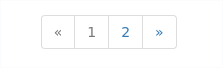

# Работа с представлениями

При разработке представлений мне пришлось реализовать несколько алгоритмов, которых
нет в поставке Django. Они связаны с особенностями реализации системы.

* [Пагинатор](#пагинатор)
* [Сортировка по полям объектов из списка](#сортировка-по-полям-объектов-из-списка)


### Пагинатор
Есть реализованный шаблон для пагинации. При использовании [Class Based View](https://docs.djangoproject.com/en/1.11/topics/class-based-views/),
в шаблоне вы можете включить страницу *templates/pagination.html*.

Например вы создали клас представления:

```python
from django.views.generic import ListView

class PaysListView(ListView):
    ...
    pass

```

Тогда в шаблоне с bootstrap вы можете подключить шаблон пагинации *templates/pagination.html* и
увидеть примерно такую пагинацию которую вы конечно же можете изменить на свою.
.


### Сортировка по полям объектов из списка
Для того чтоб иметь возможность сортировать по полю объекта из списка, в шаблоне нужно передать
имя поля по которому нужна сортировка и направление сортировки.

На примере *devapp/devices.html* можно рассмотреть такую сортировку.
Там указан url с параметрами
> \{\% url 'devapp:devs' group.pk \%\}?order_by=ip_address&dir=\{\{ dir|default:'down' \}\}

Тут обратная сортировка по полю *ip_address*, со знаком -. То есть эквивалент будет выглядеть примерно так:
> Device.objects.all().order_by('-ip_address')

После того как вы отсортируете один раз, направление поменяется, в переменную dir будет передано
значение *up*, и сортировка пройдёт без знака -

В то же время ваше представление нужно отнаследовать от OrderingMixin из *djing.global_base_views*.
Определение представления с сортировкой будет выглядеть так:

```python
from django.views.generic import ListView
from djing.global_base_views import OrderingMixin

class PaysListView(ListView, OrderingMixin):
    ...
    pass
```

Примесь *OrderingMixin* добавляет в контекст переменные *order_by* и *dir* для использования в шаблоне.
